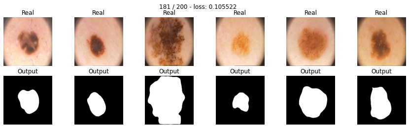

***Сегментация медицинских изображений(меланом и невусов)***

В рамках работы выполнен анализ нескольких моделей(SegNet, Unet, Unet2) и нескольких функций потерь(BCE, Dice, Focal, Tversky). В конце ноутбука приведено их сравнение(спойлер: SegNet+TverskyLoss оптимально).

Датасет: Addi Project

Ноутбук составлен: [DLS](https://www.dlschool.org/)

Пример сегментации:

***Ноутбук:*** [Тык](https://github.com/aogavrilov/CVModels/blob/master/Segmentation/%5Bhw%5Dsemantic_segmentation.ipynb)

.
