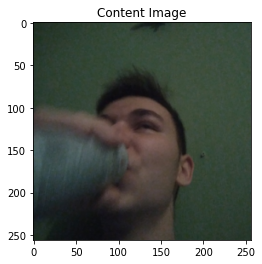
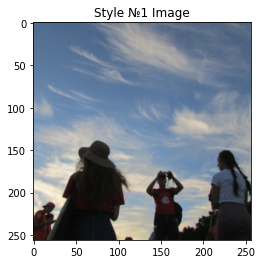
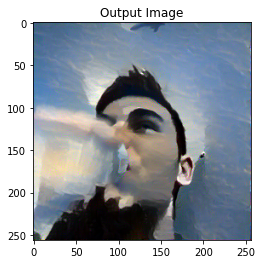
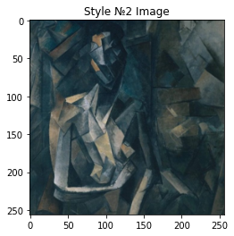
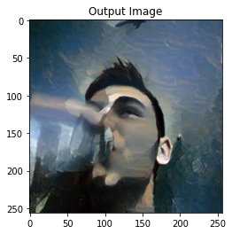

***Перенос стиля с 1(можно и 2) изображений на свое изображение.***

Реализовано с помощью алгоритма дообучения на картинке с 500 итерациями. 

[Ноутбук](https://github.com/aogavrilov/CVModels/blob/master/Style%20and%20multiStyle%20Transfer/cycleGAN%20hw.ipynb)

***Пример с переносом стиля с 1 изображения на свое.***

Исходное изображение:

Картинка со стилем:

Итоговое изображение:

***Прмер с переномом 2 стилей на 1 изображение.***

Исходное изображение то же, первый стиль такой же, а второй ниже:

Итоговая картинка:

