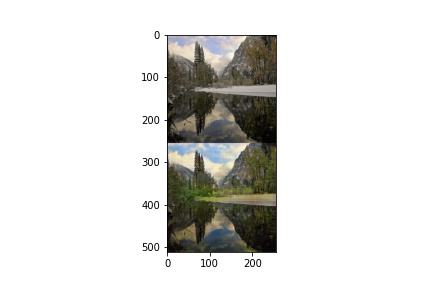
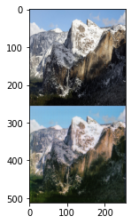

Ноутбук с преобразованием фото, сделанного зимой, в летнее фото и наоборот. Используется cycleGAN, обучен на колабе в течении 2 суток на датасете winter2summer. 

[Ноутбук](https://github.com/aogavrilov/CVModels/blob/master/Summer2Winter/cycleGAN%20hw.ipynb)

[Model files](https://drive.google.com/drive/folders/1bChtmOjOUnqdYCqs2xxvfKT78-ouVPa6?usp=sharing)

Примеры:

Модель работает не идеально, но учитывая время обучения вполне сносно. 
